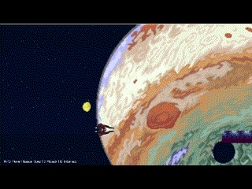

# Side scroller prototype

Prototype of a 2D side scroller game.

## Built with

* Raylib
* Assets from https://craftpix.net/
  * https://craftpix.net/freebies/free-spaceship-pixel-art-sprite-sheets/
  * https://craftpix.net/freebies/free-planets-in-space-pixel-game-background-pack/
  * https://craftpix.net/freebies/free-exclusion-zone-tileset-pixel-art/

**No AI used.**

## Music

The music is my own.

## Setup

Set up in Windows according to https://github.com/raysan5/raylib/wiki/Working-on-Windows#manual-setup-with-w64devkit (using the MSVC release).
Copied the relevant directories in this repo.

## Demo

GIF

Video (with music)

https://github.com/user-attachments/assets/5a30f93b-88c0-4091-8dad-142d404cb83d

(Note: See [this guide](https://github.com/george-hawkins/video-in-github-markdown/blob/master/embedded-examples.md) for a working video embed.)
